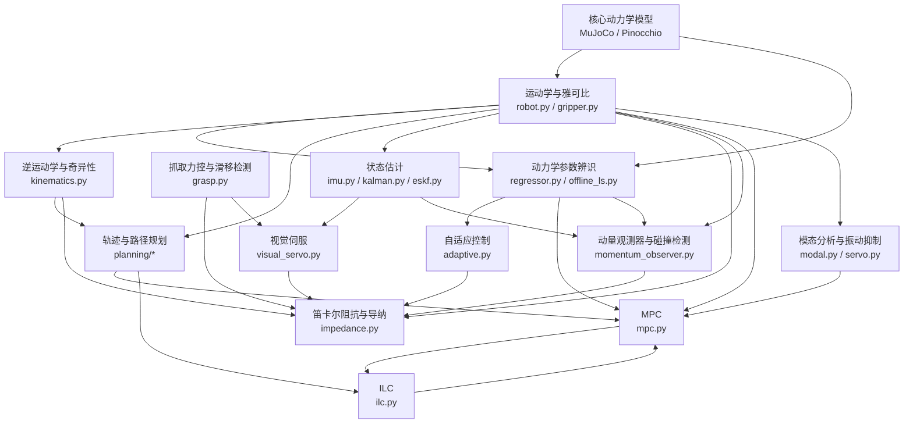

# 控制方法说明文档索引

本目录按控制方法拆成 13 篇独立文档，面向熟悉基础控制但不熟悉本项目实现的工程师。

## 文档列表

| 序号 | 文档 | 一句话说明 |
|---:|---|---|
| 01 | [笛卡尔阻抗与导纳](01_笛卡尔阻抗与导纳.md) | 把末端塑造成可调虚拟弹簧-阻尼系统，兼顾跟踪和接触柔顺。 |
| 02 | [动量观测器与碰撞检测](02_动量观测器与碰撞检测.md) | 用动力学残差估计外力矩，并据此做碰撞检测和拖动示教。 |
| 03 | [自适应控制](03_自适应控制.md) | 在线更新动力学参数或 RBF 权重，补偿负载和摩擦不确定性。 |
| 04 | [模型预测控制MPC](04_模型预测控制MPC.md) | 在未来预测窗口内显式处理力矩、速度和关节限位约束。 |
| 05 | [迭代学习控制ILC](05_迭代学习控制ILC.md) | 对重复轨迹逐遍学习前馈修正，压低可重复跟踪误差。 |
| 06 | [模态分析与振动抑制](06_模态分析与振动抑制.md) | 用耦合质量矩阵找真实模态，并用陷波、整形和串级伺服抑振。 |
| 07 | [抓取力控与滑移检测](07_抓取力控与滑移检测.md) | 计算夹持力需求，检测滑移，并自适应调节夹爪力。 |
| 08 | [视觉伺服](08_视觉伺服.md) | 根据延迟和噪声下的目标观测持续修正抓取目标点。 |
| 09 | [动力学参数辨识](09_动力学参数辨识.md) | 用回归矩阵和增量 QR 最小二乘辨识可解释力矩数据的基参数。 |
| 10 | [运动学与雅可比](10_运动学与雅可比.md) | 统一 TCP、雅可比、任务空间惯量和夹爪开口的几何口径。 |
| 11 | [逆运动学与奇异性](11_逆运动学与奇异性.md) | 用 SO(3) 连续误差、DLS 和零空间投影求稳健 IK。 |
| 12 | [轨迹与路径规划](12_轨迹与路径规划.md) | 把路径搜索、碰撞检测、倒角和时间参数化接成可执行轨迹。 |
| 13 | [状态估计](13_状态估计.md) | 融合 IMU 与运动学量测，估计位置、速度、姿态和传感器零偏。 |

## 从哪读起

| 目标 | 建议路线 |
|---|---|
| 先理解任务空间控制 | 10 → 11 → 01 → 08 → 07 |
| 先理解规划到控制链路 | 10 → 12 → 04 → 05 → 06 |
| 先理解模型和参数 | 10 → 09 → 03 → 02 |
| 关注接触安全 | 10 → 12 → 01 → 02 → 07 |
| 关注重复轨迹精度 | 12 → 09 → 04 → 05 → 06 |
| 关注抓取闭环 | 10 → 07 → 08 → 01 |
| 关注感知与估计 | 13 → 08 → 02 |

按控制层次阅读的一条完整路线：

1. **几何层**：先读 10 和 11，明确 TCP、雅可比、IK 与奇异性；
2. **规划层**：读 12，理解路径搜索、碰撞检测、倒角和时间参数化；
3. **控制层**：读 04、01 和 06，理解约束控制、任务空间柔顺和伺服振动；
4. **在线补偿层**：读 03 和 05，区分自适应与 ILC；
5. **估计与安全层**：读 13 和 02，理解 IMU/运动学融合与外力残差；
6. **任务闭环层**：读 07 和 08，理解抓取、滑移和视觉反馈；
7. **辨识层**：最后读 09，回到模型参数如何从数据中辨识。

## 模块依赖图



## 验证命令约定

运行测试或脚本时使用项目指定环境，例如：

```bash
PYTHONPATH=. python -m unittest armctrl.tests.test_mpc 2>&1 | grep -v Polishing
```

不要在普通测试中设置 `MUJOCO_GL=egl`；只有录像或渲染才需要。
